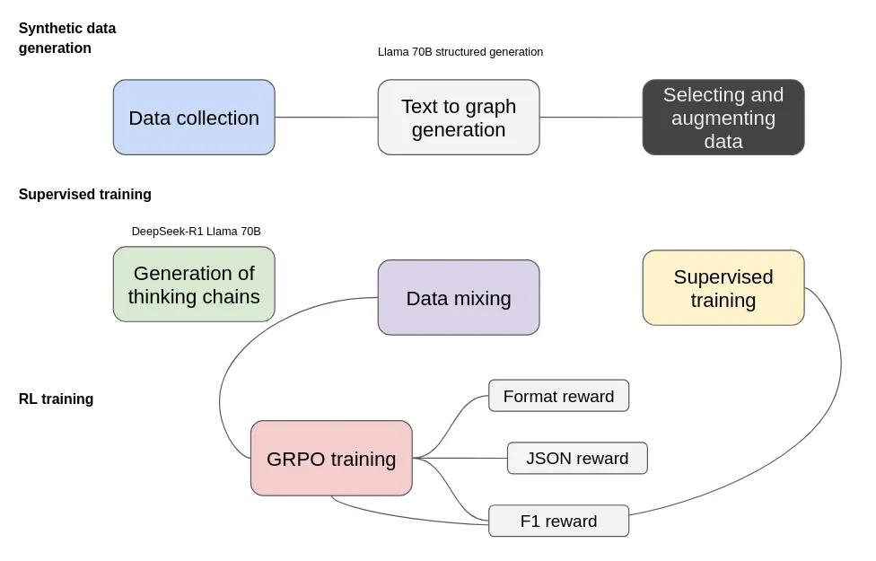
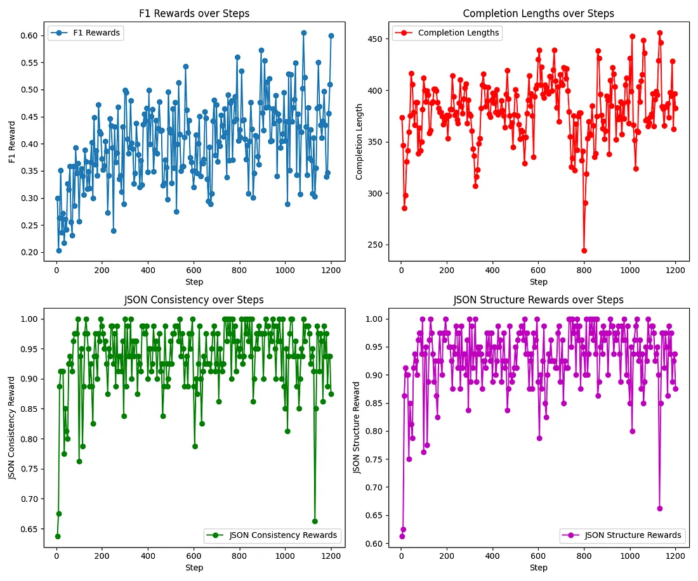

# open-r1-text2graph

The goal of this project is to reporduce **DeepSeek R1** training schema particulary for **text-to-graph** information extraction.

The project is build on top and is inpired by Hagging Face [Open-R1](https://github.com/huggingface/open-r1/tree/main) and [trl](https://github.com/huggingface/trl/tree/main/trl)

### Structure
The project currently consists of the following components:
* `src` contains the scripts to train a model using GRPO or supervised learning as well as data generation scripts.
    * `grpo.py` - trains a model using GRPO giving text-to-graph related reward functions;
    * `train_supervised.py` - trains a model in a supervised manner for text-to-graph extraction;
    * `generate.py` - generate thinking chains giving input text and extracted JSON;

### Pipeline



The training process consists of three major stages: **synthetic data generation, supervised training, and reinforcement learning (RL) training**. Each of these stages plays a crucial role in improving the model’s ability to perform structured information extraction.

1. **Synthetic Data Generation**

To bootstrap the process, we start with **data collection**, where we gather diverse text sources relevant to our target domain. The **text-to-graph** generation step, powered by **Llama 70B** structured generation, converts unstructured text into graph-based representations. However, this step is imperfect, and therefore, selecting and augmenting data becomes essential to filter out low-quality extractions and enrich the dataset with more diverse structures.

Additionally, we feed generated with structured prediction JSON data and feed them and text into **DeepSeek-R1 Llama 70B** to generate a chain of thought that can explain the extraction process.

We experimented with both thinking-enabled and disabled modes and discovered that small models struggle to discover some interesting and important thinking strategies.

2. **Supervised Training**

Before starting reinforcement learning and considering that we use small models additional supervised training is required to push model return data in the right format, We used only 1k examples for this purpose.

3. **Reinforcement Learning with GRPO**

Supervised training alone does not fully solve the problem, especially when it comes to conditioning model outputs on predefined entity and relation types. To address this, we employ **Group Relative Policy Optimization (GRPO)** for reinforcement learning.

* **Format reward** ensures that the output follows a structured format, where thinking is encapsulated in a respective tag (in the case of thinking mode).
* **JSON reward** specifically validates well-formed, machine-readable JSON representations and that its structure aligns with the desirable format.
* **F1 reward** evaluates the accuracy of extracted entities and relations by comparing them to ground truth graphs.

Below you can see how different rewards change through training steps from one of our experiments.




### Try Model

You can try one of fine-tuned model using this framework.

```python
from transformers import AutoModelForCausalLM, AutoTokenizer

model_name = "Ihor/Text2Graph-R1-Qwen2.5-0.5b"

model = AutoModelForCausalLM.from_pretrained(
    model_name,
    torch_dtype="auto",
    device_map="auto"
)
tokenizer = AutoTokenizer.from_pretrained(model_name)

text = """Your text here..."""
prompt = "Analyze this text, identify the entities, and extract meaningful relationships as per given instructions:{}"
messages = [
    {"role": "system", "content": (
                "You are an assistant trained to process any text and extract named entities and relations from it. "
            "Your task is to analyze user-provided text, identify all unique and contextually relevant entities, and infer meaningful relationships between them"
            "Output the annotated data in JSON format, structured as follows:\n\n"
            """{"entities": [{"type": entity_type_0", "text": "entity_0", "id": 0}, "type": entity_type_1", "text": "entity_1", "id": 0}], "relations": [{"head": "entity_0", "tail": "entity_1", "type": "re_type_0"}]}"""
    )},
    {"role": "user", "content": prompt.format(text)}
]
text = tokenizer.apply_chat_template(
    messages,
    tokenize=False,
    add_generation_prompt=True
)
model_inputs = tokenizer([text], return_tensors="pt").to(model.device)

generated_ids = model.generate(
    **model_inputs,
    max_new_tokens=512
)
generated_ids = [
    output_ids[len(input_ids):] for input_ids, output_ids in zip(model_inputs.input_ids, generated_ids)
]

response = tokenizer.batch_decode(generated_ids, skip_special_tokens=True)[0]
```

### Blog

Read more details about the project in the following [blog](https://huggingface.co/blog/Ihor/replicating-deepseek-r1-for-information-extraction).